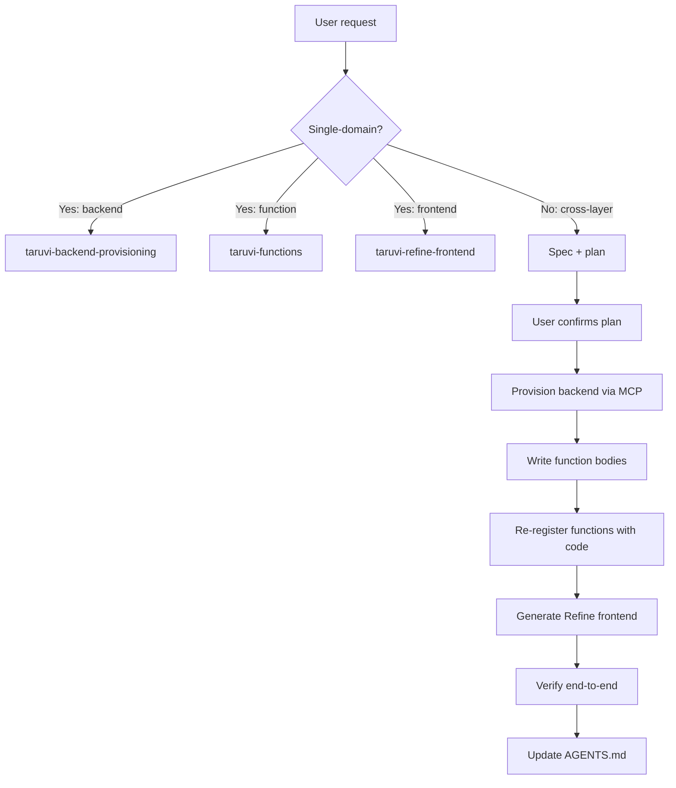

# Taruvi app builder

Orchestrate end-to-end feature development on Taruvi. This skill sets context, routes to specialists, and verifies integration. For the actual provisioning / code-writing / UI-building work, this skill delegates to three specialists.

Default delivery standard: **always build a production-ready, production-scale app.** Not a demo, not an MVP, not a prototype. Every feature must be wired to real backend data, use proper error handling, and be built to handle real-world usage. The user must explicitly ask for a reduced scope if they want anything less.

## ⚠️ Skill Compliance — Non-Negotiable

**These skills are the single source of truth for all Taruvi implementation decisions.** They override existing project code, template patterns, training data, and personal shortcuts.

1. **If a skill prescribes a specific way to implement something, use that way. No exceptions, no shortcuts, no "simpler" alternatives.**
2. **Do not copy patterns from existing project code if they contradict the skills.** Existing code may be outdated, a prototype, or pre-skill.
3. **Do not skip steps to save time.** Every step exists because skipping it causes real bugs or drift.
4. **If you cannot implement a skill requirement**, stop and ask the user instead of silently falling back to an easier approach.
5. **After implementation, verify against the skill's checklist.** If any checklist item fails, fix it before presenting the work as done.

## Core principles

1. **One layer at a time.** Don't interleave MCP provisioning and Refine UI generation in the same step. Provision first, generate second, verify third.
2. **Always plan before executing.** For any non-trivial feature, produce a short plan (entities, tables, policies, functions, pages) and have the user confirm before touching the platform.
3. **Verify against the platform, not memory.** Call MCP tools (`get_datatable_schema`, `manage_policies(action="get")`, etc.) to inspect current state before assuming.
4. **The three specialist skills own the details.** This skill is the orchestrator — it shouldn't duplicate specialist content. When in doubt about how to do something in a specific layer, route to the right specialist.

## The three layers

See [references/architecture-overview.md](references/architecture-overview.md) for the full model.

| Layer | Job | Skill |
|---|---|---|
| **MCP** | Provision backend resources: tables, roles, policies, functions, secrets, buckets | `taruvi-backend-provisioning` |
| **Python SDK** | Write function bodies that run inside Taruvi's function runtime | `taruvi-functions` |
| **Refine providers** | Build the React/Refine frontend that consumes Taruvi | `taruvi-refine-frontend` |

Project-level context (conventions, commands, env) goes in the consuming app's `AGENTS.md` / `CLAUDE.md` — see [references/agents-md-template.md](references/agents-md-template.md) for the template.

## Decision tree: which specialist?

```
Is the task single-domain?
├── Yes, backend only (tables, policies, roles, secrets, functions metadata)
│   → Activate taruvi-backend-provisioning, STOP here.
├── Yes, function body only (Python that will run in a function)
│   → Activate taruvi-functions, STOP here.
├── Yes, frontend only (Refine pages, hooks, UI)
│   → Activate taruvi-refine-frontend, STOP here.
└── No — the task spans two or more layers
    → Use the feature-add workflow below. Delegate to specialists in sequence.
```

## Function or provider? (frontend routing)

When you're inside the frontend and wondering whether an operation should be a direct Refine call or a serverless function, use this rule:

**Does the task touch more than one resource?** (resources = datatables, storage buckets, users, secrets, analytics queries)

- **No** — single-resource CRUD → use Refine hooks directly via the right provider.
- **Yes** — 2+ resources, or any of the triggers below → use a Taruvi function.

| Trigger | Why a function | Where the skill detail lives |
|---|---|---|
| Multi-resource create/update/delete cascade | Atomic, auditable, no race conditions | `taruvi-functions/references/scenarios.md` Scenario 1–2 |
| Reacting to a data-change event (RECORD_CREATE, etc.) | Runs server-side on the event | `taruvi-functions/references/scenarios.md` Scenario 4 |
| Scheduled job (cron) | No user triggers it | `taruvi-functions/references/scenarios.md` Scenario 3 |
| External API call with a stored secret | Don't leak credentials to the browser | `taruvi-functions/references/scenarios.md` Scenario 5 |
| Long-running task (>30s) | Async execution, task-id polling | `taruvi-functions/references/function-templates.md` (async fan-out) |
| Public webhook receiver | `is_public=True` endpoint | `taruvi-functions/references/scenarios.md` Scenario 5 |
| Authorization-gated server-side logic | Runs with service credentials, not user | `taruvi-functions/references/auth-patterns.md` |

If the answer is "yes, it's a function," the workflow splits into two steps:

1. Register the function metadata via `taruvi-backend-provisioning` (`manage_function(action="create_update", ...)`).
2. Write the function body via `taruvi-functions`, then re-register with the `code` field populated.

## Dashboard query strategy

Before writing any dashboard query, check: does this element need data from more than one table?

- **Single-table aggregates** → use datatable provider with `useList` + `meta.aggregate`/`groupBy`. This is the default for most dashboards.
- **Multi-table visualizations (2 or more tables)** → use saved analytics queries via `appDataProvider` + `useCustom` with `meta.kind: "analytics"`. Required when a dashboard element needs to combine data from 2 or more tables to render.
- **Row query + derive in React** is never allowed for summary metrics. Always push aggregation to the server.

Example: "revenue by department" needs orders + departments = 2 tables → analytics. "Orders by status" only needs orders = 1 table → datatable aggregate.

## Production-ready defaults

Unless the user explicitly scopes down:

- **Dashboards** show live data, automatically calculated — never hardcoded or demo values.
- **Lists** use backend pagination (default `pageSize: 10`), server-side search/filter/sort, visible search + filter controls, `useDataGrid` for MUI DataGrid.
- **Dropdowns** with backend options use debounced server-side `Autocomplete` with pagination — not static `Select`.
- **Notifications** use Refine's `notificationProvider` — no custom toast systems.
- **Access control** uses prefixed ACL resource strings (`datatable:employees`, `function:run-report`, `query:dashboard-summary`). Do not use `params.entityType`.
- **Optional chaining** (`?.`) is required when accessing properties on hook results — data may be `undefined` during loading.
- **Populate safety** requires schema validation first: only use `meta.populate` with fields that are declared relationships on the datatable. Do not assume UUID columns are populate-capable relationships.

## Greenfield scaffold workflow

For a new Taruvi app from scratch:

1. **Interview**. Clarify: what does the app do? What entities? Auth model (email/pass, OAuth)? Who are the roles?

2. **Tenant setup** (if fresh tenant). Usually handled outside this workflow by Taruvi admin; if not, use `create_tenant` via Django management command (document in the app's README).

3. **Refine app scaffold**. Create a new Refine project:
   ```bash
   npm create refine-app@latest my-app -- --template=vite-antd --template-features=typescript,tailwind
   ```
   Install Taruvi packages:
   ```bash
   cd my-app
   npm install @taruvi/sdk @taruvi/refine-providers
   ```

4. **Wire providers**. Replace `App.tsx` provider wiring with the Taruvi providers — see [references/feature-workflow-examples.md](references/feature-workflow-examples.md) for a full snippet. Activate `taruvi-refine-frontend` for details.

5. **Provision the schema**. Activate `taruvi-backend-provisioning`. Define entities as a Frictionless Data Package, create the tables.

6. **Provision roles + policies**. Still in `taruvi-backend-provisioning`. Create roles, Cerbos policies, initial role assignments.

7. **Write functions (if needed)**. Register function metadata via `taruvi-backend-provisioning` (`manage_function`), then activate `taruvi-functions` to write the bodies.

8. **Generate Refine pages**. Activate `taruvi-refine-frontend`. Generate list / show / edit / create pages for each resource, wire access control.

9. **Configure the app's AGENTS.md**. Emit the template from [references/agents-md-template.md](references/agents-md-template.md) with the specifics for this app.

10. **Verify end-to-end**. Run the Refine dev server, walk through the primary user flow, confirm auth + CRUD + policy enforcement.

See [references/feature-workflow-examples.md](references/feature-workflow-examples.md) for worked examples.

## Feature-add workflow (existing app)

For adding a feature to an existing Taruvi app:

1. **Spec**. Describe the feature in one paragraph. Identify: new entities, new policies, new functions, new pages.

2. **Plan** — emit this structure for user review:
   ```
   Feature: <name>

   Backend (MCP):
   - Datatables: <new or modified>
   - Policies: <new rules>
   - Roles: <if new>
   - Functions (metadata): <slug + mode>
   - Secrets: <if new>

   Functions (bodies):
   - <slug>: <one-line description>

   Frontend (Refine):
   - Resources to add to Refine `resources[]`: <list>
   - Pages: list / show / edit / create for each
   - Access control: <rules>

   Verification:
   - <what the user tests>
   ```
   Get user confirmation before executing.

3. **Provision backend** — delegate to `taruvi-backend-provisioning`. Call MCP tools in order: schema → roles → policies → function metadata → secrets.

4. **Write function bodies (if any)** — delegate to `taruvi-functions`. After writing, re-register via `manage_function(action="create_update", code=<body>)` in the backend-provisioning skill.

5. **Generate frontend** — delegate to `taruvi-refine-frontend`. Add Refine resources, generate CRUD pages, wire `useCan` and `meta.allowedActions`.

6. **Verify**. Run the app locally. Confirm: tables are reachable, policies gate correctly, functions execute, Refine pages render.

## Integration gotchas

See [references/integration-pitfalls.md](references/integration-pitfalls.md) for the full list. Top hits:

1. **Create policies before first write.** If a policy is missing, the first insert to the table 403s. Policy → table materialization → first insert.
2. **`meta.idColumnName` in Refine must match the Frictionless `primaryKey`.** Non-`id` PKs need `idColumnName` on every hook. Or alias via `meta.tableName` with an `id` column aliased in an analytics view.
3. **Function metadata and body live in different surfaces.** Use `manage_function` (MCP) to register; write the body in `taruvi-functions` context; re-call `manage_function(action="create_update", code=<body>)` to deploy.
4. **Async functions return a task id, not a result.** Refine's `useCustom` with `meta.kind: "function"` expects a sync response. Either keep the function sync, or poll for the result client-side.
5. **Env vars are critical.** The consuming app needs `TARUVI_API_URL`, `TARUVI_API_KEY`, `TARUVI_APP_SLUG` (front-end: `REACT_APP_*` or `VITE_*` prefix). See [references/env-setup.md](references/env-setup.md).
6. **Tenant schema matters in dev.** Local dev often means pointing at a specific tenant subdomain or passing an `X-Tenant` header. Document the dev setup in the app's AGENTS.md.
7. **JWT expiry cascades.** If a Refine user's JWT expires, they get 401 → `authProvider.onError` → forced logout. No silent refresh in the default flow. Long-lived sessions need refresh-token handling (outside default).

## Verification checklist

After a feature lands, confirm:

- [ ] Datatable exists and has the expected schema (`get_datatable_schema`).
- [ ] Policy exists and is enabled (`manage_policies(action="get")`).
- [ ] Role assignments are correct for a representative test user.
- [ ] Function (if any) executes without error (`execute_function`). Check the response format — frontend must adapt the backend response format.
- [ ] Analytics query (if any) executes without error (`execute_query`). Check column names — frontend must adapt the backend response format.
- [ ] If access control is configured: ALWAYS create test users for each role before marking the task complete. Do not skip this unless the user explicitly says no user creation.
- [ ] Test user naming must be deterministic: `qa_<role_slug>_<YYYYMMDD>` (example: `qa_inventory_manager_20260422`).
- [ ] Test user passwords must be strong and unique (12+ chars with upper/lower/digit/symbol), then reported with usernames in the final output.
- [ ] Include cleanup guidance in the final output: either deactivate/delete created `qa_*` users after validation or rotate their passwords.
- [ ] Refine resources are in `resources[]` and map correctly.
- [ ] List page renders with data, filters work, pagination works.
- [ ] Any `meta.populate` usage only references declared table relationships (no plain UUID field names unless explicitly declared as relationships).
- [ ] Edit page saves, Cerbos allows/denies as expected.
- [ ] `useCan` gates the right UI elements.
- [ ] Storage uploads/downloads work (if file-backed).

## Workflow diagram



## When you get stuck

- Architecture overview: [references/architecture-overview.md](references/architecture-overview.md)
- Feature workflow examples (3 worked): [references/feature-workflow-examples.md](references/feature-workflow-examples.md)
- AGENTS.md template for consuming apps: [references/agents-md-template.md](references/agents-md-template.md)
- Env var setup: [references/env-setup.md](references/env-setup.md)
- Integration pitfalls: [references/integration-pitfalls.md](references/integration-pitfalls.md)
- Deployment workflow (Frontend Workers): [references/deployment.md](references/deployment.md)
- For specialist detail, load the matching specialist skill's `SKILL.md` and relevant reference files.
